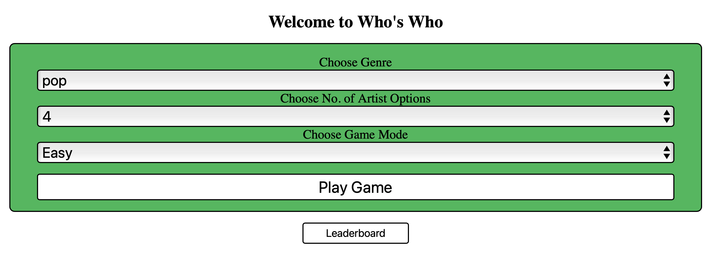

# Who's Who

## Overview

Who's Who is an interactive web application built with Angular, leveraging the Spotify API to create a musical guessing game. This project was developed to explore the integration of third-party APIs with Angular applications and to enhance my skills in front-end development.



## Features

- **Song Snippets**: Play snippets of songs fetched from Spotify and guess the artists or song titles.
- **Multiple Choice Questions**: Choose the correct answer from a set of options.
- **Score Tracking**: Keep track of your correct guesses and total attempt, including leaderboard status.
- **Playing Modes**: Play easy or hard mode, choose your genre, and number of options.
- **Responsive Design**: Enjoy the game on any device, thanks to a mobile-first approach.

## Built With

- Angular - The web framework used
- Spotify Web API - For fetching song information and previews

## Getting Started

### Prerequisites

Before you begin, ensure you have the following installed:

- Node.js (latest LTS version)
- Angular CLI

Additionally, you might need a Spotify Developer account to access the Spotify API.

### Installation

1. Clone the repository to your local machine:

   ```bash
   git clone https://github.com/yourusername/spotify-guessing-game.git
   ```

2. Navigate to the project directory:

   ```bash
   cd Who's Who
   ```

3. Install the required npm packages:

   ```bash
   npm install
   ```

4. Start the development server:
   ```bash
   ng serve
   ```

5. Open http://localhost:4200 in your browser to view the application.

## Contributing

Contributions are what make the open-source community such an amazing place to learn, inspire, and create. Any contributions you make are greatly appreciated.
